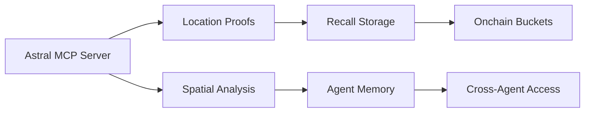
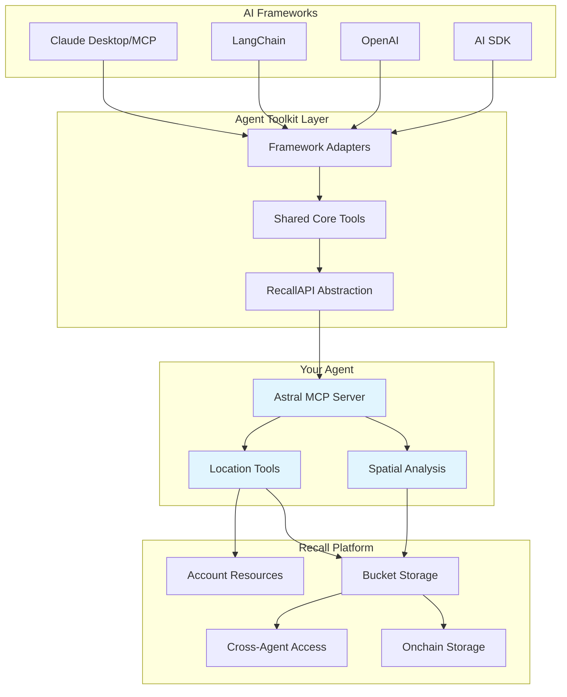

## Recall Platform Integration

After completing the basic Astral MCP server implementation, we plan to to extend its capabilities by integrating with the [Recall Platform](https://docs.recall.network) ecosystem to add persistent memory, cross-agent collaboration, and onchain storage for location attestation analysis.

### Why Integrate with Recall?

The Recall Platform provides powerful primitives that enhance your Astral MCP agent:

- **Persistent Memory**: Store location attestation analysis and insights onchain for long-term agent memory
- **Cross-Agent Collaboration**: Enable other agents to access and build upon your location proof data
- **Onchain Storage**: Immutable storage of attestation patterns, spatial analysis, and decision-making processes
- **RAG Enhancement**: Store embeddings and documents to improve spatial query responses
- **Agent Ecosystem**: Join a network of agents with complementary capabilities

### Integration Architecture

The following diagram illustrates the specific integration architecture between the Astral MCP server and the Recall Platform:



Zooming out a bit further, the following diagram shows how the Astral MCP server fits into the broader Recall ecosystem:



In the above diagram, we're depicting the Recall ecosystem as a multi-layered architecture:

1. **AI Frameworks Layer**: Shows how different AI frameworks (Claude Desktop/MCP, LangChain, OpenAI, AI SDK) can all connect to the Recall platform
2. **Agent Toolkit Layer**: The middleware that provides framework adapters, shared tools, and the RecallAPI abstraction
3. **Astral MCP Agent**: Highlights where the Astral MCP Server fits in as a *specialized agent*, with its specific location tools and spatial analysis capabilities
4. **Recall Network**: The underlying infrastructure providing account management, storage, cross-agent collaboration, and onchain persistence

From this vantage, the Astral MCP agent becomes a specialized participant on the Recall platform, leveraging its tools to provide location-based insights and analysis while also contributing to the broader network of agents.

### Implementation Phases

The following sections outline at a high level the implementation phases for **Stage 2 development**, integrating the Astral MCP server with the Recall platform

#### Phase 1: Basic Storage Integration

Add Recall storage capabilities to your existing Astral MCP server:

```python
@mcp.tool()
async def store_location_analysis(proof_data: dict, analysis: str, tags: list = None) -> dict:
    """Store location proof analysis in Recall for long-term memory
    
    Args:
        proof_data: Original location proof data from Astral API
        analysis: AI-generated analysis and insights
        tags: Optional tags for categorization and retrieval
        
    Returns:
        dict: Storage confirmation with bucket and object details
    """
    # Store analysis onchain for future reference and agent learning

@mcp.tool() 
async def retrieve_location_insights(location: str, time_range: str = None) -> dict:
    """Retrieve stored location insights from previous analyses
    
    Args:
        location: Geographic coordinates or area identifier
        time_range: Optional time filter for historical data
        
    Returns:
        dict: Historical insights and patterns for the location
    """
    # Query stored analysis data for location-based insights

@mcp.tool()
async def discover_location_patterns() -> dict:
    """Analyze stored data to discover emerging location attestation patterns
    
    Returns:
        dict: Discovered patterns, trends, and anomalies across stored data
    """
    # Cross-reference stored data to identify spatial and temporal patterns
```

#### Phase 2: Agent Memory \& Context

Implement persistent context that survives across sessions:

- **Session Continuity**: Remember previous queries and analysis contexts
- **Learning Patterns**: Build knowledge graphs of location relationships
- **User Preferences**: Store user-specific query patterns and interests
- **Collaborative Insights**: Share discoveries with other agents in the ecosystem

#### Phase 3: Cross-Agent Capabilities

Enable your location data to be discoverable and useful to other agents:

- **Spatial Services**: Provide location verification services to other agents
- **Attestation Validation**: Offer location proof validation for cross-chain operations
- **Geospatial Intelligence**: Share insights about regional attestation patterns
- **Risk Assessment**: Provide location-based risk analysis for other use cases

---

### Getting Started with Recall Integration

1. **Install the Recall Agent Toolkit**:

```bash
npm install @recallnet/agent-toolkit
```

2. **Set up your Recall account and credentials** following the [installation guide](https://docs.recall.network/advanced/agent-toolkit/installation)
3. **Extend your existing MCP server** with Recall storage tools
4. **Configure storage buckets** for different types of location data:
    - `location-proofs`: Raw attestation data from Astral API
    - `spatial-analysis`: AI-generated insights and patterns
    - `temporal-trends`: Time-series analysis and forecasts
    - `user-context`: Session data and user preferences

### Use Cases Enabled by Recall Integration

**For Individual Users:**

- **Personal Location History**: Build a private, verifiable record of location attestations
- **Travel Insights**: Analyze movement patterns and location verification over time
- **Security Monitoring**: Track and alert on unusual location attestation patterns

**For Developers \& Researchers:**

- **Spatial Data Science**: Build datasets for location-based research and analysis
- **Attestation Analytics**: Study EAS usage patterns across different geographic regions
- **Cross-Chain Analysis**: Compare location verification across different blockchain networks

**For Agent Ecosystems:**

- **Location Oracle Services**: Provide verified location data to other agents
- **Reputation Systems**: Build location-based trust and verification networks
- **Collaborative Mapping**: Contribute to community-driven location intelligence

---

### Example Integration Workflow

1. **Query location proofs** using existing Astral MCP tools
2. **Analyze spatial patterns** using AI-powered analysis
3. **Store insights onchain** via Recall storage tools
4. **Share discoveries** with other agents in the network
5. **Build on collective knowledge** for enhanced location intelligence

### Future Possibilities

As the Recall ecosystem grows, the Astral MCP agent could:

- **Collaborate with IoT agents** for sensor-verified location data
- **Work with identity agents** for privacy-preserving location verification
- **Partner with DeFi agents** for location-based financial services
- **Support governance agents** with geographic voting and representation

---

### Resources

- [Recall Network Documentation](https://docs.recall.network)
- [Agent Toolkit MCP Guide](https://docs.recall.network/advanced/mcp)
- [Storage System Overview](https://docs.recall.network/advanced/agents/storage)
- [Recall MCP Server Examples](https://github.com/recallnet/recall-mcp)

*This integration represents the next evolution of your Astral MCP agent—from a standalone location querying tool to a collaborative participant in a broader agent ecosystem with persistent memory and cross-agent intelligence.*
